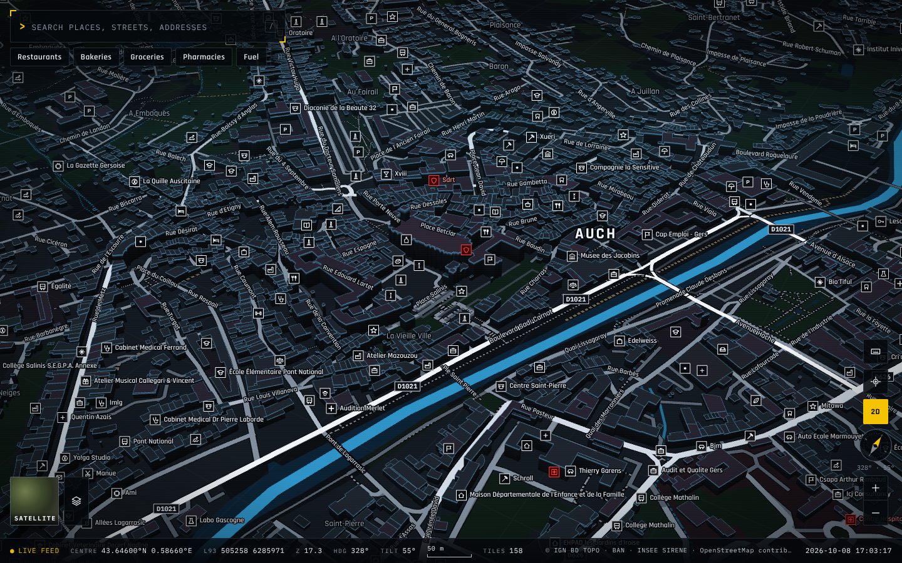

# Master Maps

[English](#english) | [Français](#français)

## English

Master Maps is a 3D map of the whole Gers department (France, department 32), built only from official open data and OpenStreetMap. It shows every commune, street, address, building, road number, river and some 20,000 businesses, and finds any of them as you type. The interface takes its look from The Machine in *Person of Interest*: a dark, instrument-like map with yellow brackets, live telemetry and dossiers for every feature.

It runs in any current browser through WebGL (three.js and React Three Fiber in a Next.js 16 / React 19 app). See [the architecture](docs/architecture.md).


*Figure 1. The whole department.*



*Figure 2. Auch in 3D.*

### Moving around

| Action | Mouse or trackpad | Touch | Keyboard |
| --- | --- | --- | --- |
| Pan | Drag (it glides when thrown) | One finger | Arrows or H J K L |
| Zoom | Wheel or trackpad pinch, around the cursor; double-click (Shift: out) | Pinch around the fingers; double-tap; two-finger tap to zoom out | + and − |
| Rotate | Right-drag or Ctrl+drag sideways | Two-finger twist | Shift + ← → |
| Tilt | Right-drag or Ctrl+drag up and down, or the 3D button | Two-finger vertical slide | Shift + ↑ ↓ |
| Face north, flatten | Click the compass | Tap the compass | N |
| Whole department | | | 0 |

`/` focuses the search, `?` lists every shortcut and Escape closes panels. Typing in the search box never moves the map. The address bar always holds the current view (`#map=zoom/lat/lon/bearing/tilt`), so a link reopens the same place, angle and tilt. See [controller.ts](src/lib/map/controller.ts) and [transform.ts](src/lib/map/transform.ts).

Clicking a place opens its dossier: category, brand, SIRET, address, WGS84 and Lambert-93 coordinates, phone, website, opening hours with an open-now status, building height, road number, class and width, and the sources the record came from. A right-click asks "What's here?", centres, zooms or copies coordinates. The layer button switches between the Machine map and IGN aerial imagery and toggles buildings, roads, water, land cover, rail and airfields, boundaries, labels, businesses, places, house numbers and a metric grid. See [MapShell.tsx](src/components/map/MapShell.tsx) and [the HUD components](src/components/map/hud/).

### Search

Search works the way people type: `pharmacie auch`, `12 bis rue gambetta`, `st clar`, `N124`, `d 930`, `boulangerie`, `leclerc`, `cathedrale` all land where expected. Every word must match the result's name, aliases, street, commune, postcode, road number or category, with tolerance for accents, hyphens, abbreviations, plurals, unfinished words and typos. Results nearer the current view rank higher, a bare category lists the nearest places of that kind, and the chips under the search box show restaurants, bakeries, groceries, pharmacies, fuel, hotels, doctors, banks, things to do or parking around the view. A street is one result per commune with its full extent, not one per segment. See [searchEngine.ts](src/lib/data/searchEngine.ts) and [build-search-index.ts](scripts/data/build-search-index.ts).

### Data

| Source | Licence | Used for |
| --- | --- | --- |
| IGN BD TOPO 3.5, edition 15 September 2026 | Licence Ouverte 2.0 | Buildings, the road network with numbers and classes, rivers and lakes, land cover, the 458 communes with population, hamlets and lieux-dits, public places |
| IGN Admin Express COG | Licence Ouverte 2.0 | Department boundary |
| Base Adresse Nationale | Licence Ouverte 2.0 | All 115,483 addresses, including bis/ter numbers |
| INSEE SIRENE (recherche-entreprises) | Licence Ouverte 2.0 | Active establishments with name, activity, SIRET and position |
| OpenStreetMap (daily Gers extract) | ODbL 1.0 | Shops and amenities with hours, phones and websites, landmarks, service roads, tracks and paths |
| IGN orthophotos (Géoplateforme WMTS) | Licence Ouverte 2.0 | Satellite view |

Each activity code, OSM tag and BD TOPO nature maps onto one category taxonomy, so a SIRENE pharmacy and an OSM `amenity=pharmacy` are the same kind of place. Holding companies, property SCIs and other activities without a public place are left out. An OSM place and a SIRENE establishment with the same name close together become one record carrying both identities. SIRENE establishments without coordinates are placed on their exact BAN address, a neighbouring number, a compact street or their BD TOPO lieu-dit. See [categories.ts](src/lib/data/categories.ts), [conflate.ts](scripts/data/conflate.ts) and [fetch-businesses.ts](scripts/data/fetch-businesses.ts).

Google Maps is not a data source. A list of things people commonly look up on Google Maps served as a checklist for [the coverage benchmark](docs/coverage-benchmark.md), and every answer there comes from the sources above.

### How it is built

`npm run data:refresh` downloads the sources into a local HTTP cache and runs the pipeline: normalise and validate every feature, deduplicate across sources, cut 2,048 m / 8,192 m / 32,768 m tiles in the MMT2 binary format, build the search index, then check spatial QA, coverage and validation. The browser streams only the tiles in view, draws ground, lines and buildings with WebGL shaders and puts labels and markers on a 2D overlay. See [data refresh](docs/data-refresh.md) and [the architecture](docs/architecture.md).

### Run it

```bash
npm ci
npm run data:refresh      # needs GDAL (ogr2ogr), osmium-tool and 7z
npm run build
npm run start
```

`npm run data:build` rebuilds from the cached sources without network access, and `npm run data:build -- --from-tiles` rebuilds from the tiles onwards. Data lives in `data/` and is not committed.

Checks: `npm run typecheck`, `npm run lint`, `npm test` (unit and integration), `npm run test:e2e` (Playwright against the production server, with a Moli browser or the local Chromium) and `npm run qa:benchmark` (coverage benchmark).

### Limits

- About 5,000 active SIRENE establishments registered only by commune, with no street or lieu-dit, cannot be placed and are not shown.
- Opening hours, phones and websites exist only where OpenStreetMap contributors recorded them; there are no reviews or photos.
- The satellite view depends on the IGN Géoplateforme service.
- Headless browsers render WebGL in software (SwiftShader); real GPUs are much faster.

### Further reading

- [Architecture](docs/architecture.md)
- [Coverage benchmark](docs/coverage-benchmark.md)
- [Data sources](docs/data-sources.md)
- [Data provenance](docs/data-provenance.md)
- [Data refresh](docs/data-refresh.md)

## Français

Master Maps est une carte 3D de tout le Gers (département 32), construite uniquement à partir de données publiques ouvertes et d'OpenStreetMap. Elle montre chaque commune, rue, adresse, bâtiment, numéro de route, cours d'eau et quelque 20 000 entreprises, et les retrouve dès la saisie. L'interface s'inspire de la Machine de *Person of Interest* : une carte sombre, façon instrument, avec des crochets jaunes, une télémétrie en direct et une fiche pour chaque objet.

Elle fonctionne dans tout navigateur récent grâce à WebGL (three.js et React Three Fiber dans une application Next.js 16 / React 19). Voir [l'architecture](docs/architecture.md).


*Figure 1. Le département entier.*


*Figure 2. Auch en 3D.*

### Se déplacer

| Action | Souris ou pavé tactile | Tactile | Clavier |
| --- | --- | --- | --- |
| Déplacer | Glisser (la carte file quand on la lance) | Un doigt | Flèches ou H J K L |
| Zoomer | Molette ou pincement du pavé, autour du pointeur ; double-clic (Maj : arrière) | Pincer autour des doigts ; double tape ; tape à deux doigts pour reculer | + et − |
| Tourner | Glisser avec le bouton droit ou Ctrl, horizontalement | Rotation à deux doigts | Maj + ← → |
| Incliner | Glisser avec le bouton droit ou Ctrl, verticalement, ou le bouton 3D | Glisser deux doigts verticalement | Maj + ↑ ↓ |
| Nord en haut, vue à plat | Cliquer la boussole | Toucher la boussole | N |
| Tout le département | | | 0 |

`/` place le curseur dans la recherche, `?` liste les raccourcis et Échap ferme les panneaux. La saisie dans la recherche ne déplace jamais la carte. La barre d'adresse garde la vue courante (`#map=zoom/lat/lon/cap/inclinaison`) : un lien rouvre le même lieu, le même angle et la même inclinaison. Voir [controller.ts](src/lib/map/controller.ts) et [transform.ts](src/lib/map/transform.ts).

Un clic sur un lieu ouvre sa fiche : catégorie, enseigne, SIRET, adresse, coordonnées WGS84 et Lambert-93, téléphone, site, horaires avec l'état ouvert/fermé, hauteur du bâtiment, numéro, classe et largeur de la route, et les sources de l'enregistrement. Le clic droit propose « Qu'y a-t-il ici ? », centrer, zoomer ou copier les coordonnées. Le bouton des couches bascule entre la carte Machine et les photos aériennes de l'IGN et affiche ou masque bâtiments, routes, eau, occupation du sol, voies ferrées et aérodromes, limites, étiquettes, entreprises, lieux, numéros et une grille métrique. Voir [MapShell.tsx](src/components/map/MapShell.tsx) et [les composants d'interface](src/components/map/hud/).

### Recherche

La recherche suit la façon de taper : `pharmacie auch`, `12 bis rue gambetta`, `st clar`, `N124`, `d 930`, `boulangerie`, `leclerc`, `cathedrale` mènent au bon endroit. Chaque mot doit correspondre au nom, aux variantes, à la rue, à la commune, au code postal, au numéro de route ou à la catégorie du résultat, en tolérant accents, traits d'union, abréviations, pluriels, mots inachevés et fautes de frappe. Les résultats proches de la vue passent devant, une catégorie seule liste les lieux les plus proches, et les catégories sous la recherche montrent restaurants, boulangeries, alimentation, pharmacies, carburant, hôtels, médecins, banques, sorties ou parkings autour de la vue. Une rue est un seul résultat par commune avec son emprise entière, et non un résultat par tronçon. Voir [searchEngine.ts](src/lib/data/searchEngine.ts) et [build-search-index.ts](scripts/data/build-search-index.ts).

### Données

| Source | Licence | Usage |
| --- | --- | --- |
| IGN BD TOPO 3.5, édition du 15 septembre 2026 | Licence Ouverte 2.0 | Bâtiments, réseau routier avec numéros et classes, cours d'eau et plans d'eau, occupation du sol, les 458 communes avec leur population, hameaux et lieux-dits, établissements recevant du public |
| IGN Admin Express COG | Licence Ouverte 2.0 | Limite du département |
| Base Adresse Nationale | Licence Ouverte 2.0 | Les 115 483 adresses, numéros bis/ter compris |
| INSEE SIRENE (recherche-entreprises) | Licence Ouverte 2.0 | Établissements actifs avec nom, activité, SIRET et position |
| OpenStreetMap (extrait quotidien du Gers) | ODbL 1.0 | Commerces et services avec horaires, téléphones et sites, monuments, voies de service, chemins et sentiers |
| Orthophotos IGN (WMTS Géoplateforme) | Licence Ouverte 2.0 | Vue satellite |

Codes d'activité, étiquettes OSM et natures BD TOPO se ramènent à une seule taxonomie : une pharmacie SIRENE et un `amenity=pharmacy` OSM sont le même genre de lieu. Les holdings, SCI patrimoniales et autres activités sans lieu ouvert au public sont écartées. Un lieu OSM et un établissement SIRENE du même nom et proches deviennent un seul enregistrement portant les deux identités. Les établissements SIRENE sans coordonnées sont placés sur leur adresse BAN exacte, un numéro voisin, une rue compacte ou leur lieu-dit BD TOPO. Voir [categories.ts](src/lib/data/categories.ts), [conflate.ts](scripts/data/conflate.ts) et [fetch-businesses.ts](scripts/data/fetch-businesses.ts).

Google Maps n'est pas une source. Une liste de lieux couramment cherchés sur Google Maps a servi de liste de contrôle pour [le banc de couverture](docs/coverage-benchmark.md), et chaque réponse y provient des sources ci-dessus.

### Fabrication

`npm run data:refresh` télécharge les sources dans un cache HTTP local puis enchaîne : normalisation et validation de chaque objet, dédoublonnage entre sources, découpage en tuiles de 2 048 m, 8 192 m et 32 768 m au format binaire MMT2, index de recherche, puis contrôles spatiaux, de couverture et de validité. Le navigateur ne charge que les tuiles visibles, dessine sol, lignes et bâtiments avec des shaders WebGL et place étiquettes et repères sur un calque 2D. Voir [la mise à jour des données](docs/data-refresh.md) et [l'architecture](docs/architecture.md).

### Lancer

```bash
npm ci
npm run data:refresh      # nécessite GDAL (ogr2ogr), osmium-tool et 7z
npm run build
npm run start
```

`npm run data:build` reconstruit depuis le cache sans réseau, et `npm run data:build -- --from-tiles` reprend à partir des tuiles. Les données vivent dans `data/` et ne sont pas versionnées.

Contrôles : `npm run typecheck`, `npm run lint`, `npm test` (unitaires et d'intégration), `npm run test:e2e` (Playwright sur le serveur de production, avec un navigateur Moli ou le Chromium local) et `npm run qa:benchmark` (banc de couverture).

### Limites

- Environ 5 000 établissements SIRENE actifs enregistrés seulement à la commune, sans rue ni lieu-dit, ne peuvent pas être placés et n'apparaissent pas.
- Horaires, téléphones et sites n'existent que là où les contributeurs d'OpenStreetMap les ont saisis ; il n'y a ni avis ni photos.
- La vue satellite dépend du service Géoplateforme de l'IGN.
- Les navigateurs sans écran rendent WebGL en logiciel (SwiftShader) ; une vraie carte graphique est bien plus rapide.

### Pour aller plus loin

- [Architecture](docs/architecture.md)
- [Banc de couverture](docs/coverage-benchmark.md)
- [Sources de données](docs/data-sources.md)
- [Provenance des données](docs/data-provenance.md)
- [Mise à jour des données](docs/data-refresh.md)
