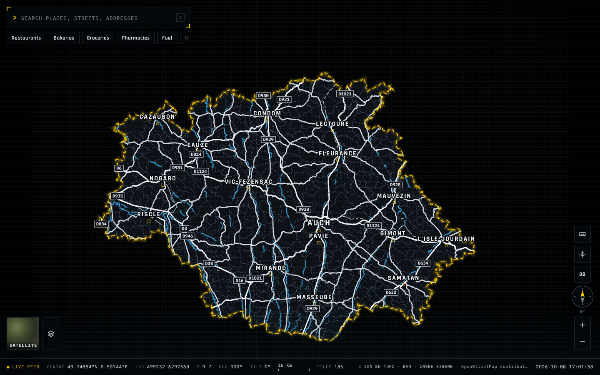

# Master Maps

[English](#english) | [Français](#français)

## English

Master Maps is a top-down WebGPU map of the entire Gers department in France. It helps users explore geographic features and inspect source-backed records across department 32. See [the architecture overview](docs/architecture.md) and [the coverage notes](docs/coverage.md).

The client uses Next.js 16, React 19, TypeScript, Three.js, and React Three Fiber. It requires WebGPU and has no WebGL fallback. The camera stays top-down, and the scene has no terrain relief. See [package.json](package.json), [the architecture overview](docs/architecture.md), and [the accuracy audit](docs/accuracy-audit.md).

### Demo image



*Figure 1. Department overview of the Gers map in the browser.*

The capture shows the Gers outline, settlement labels, orange feature marks, search field, layer control, and source credits. It was taken after WebGPU initialized. At capture, the page reported 225 loaded tiles and 1,582 draw calls on an AMD adapter with `gcn-5` architecture. The per-kind and loaded-feature counters reported 0 in the same capture. See [the runtime verification record](data/qa/runtime-verification.json) and [the screenshot](docs/media/gers-overview.png).

### Map controls

- Left-click a feature to select it and draw its silhouette highlight. See [CityScene.tsx](src/components/map/CityScene.tsx) and [FeatureHighlightLayer.tsx](src/components/map/FeatureHighlightLayer.tsx).
- Right-click a feature to open its context menu. The menu can inspect or centre the feature and copy its coordinates, name, address, identifier, or road class and width. The native browser menu is suppressed while the feature menu is open. See [FeatureContextMenu.tsx](src/components/map/FeatureContextMenu.tsx) and [MapCamera.tsx](src/components/map/MapCamera.tsx).
- Use H, J, K, and L or the arrow keys to pan in world directions. Use plus and minus to zoom. Right-drag to rotate the map heading. See [MapControls.tsx](src/components/map/MapControls.tsx), [mapNavigation.ts](src/components/map/mapNavigation.ts), and [MapCamera.tsx](src/components/map/MapCamera.tsx).
- Use one finger to pan. Use two fingers to zoom and rotate. See [useControlOrbit.ts](src/components/map/useControlOrbit.ts).
- Wheel zoom is intended to stay under the cursor. Pixel-mode wheel events are dropped, so standard mouse and trackpad zoom goes unzoomed. See [the limitations below](#runtime-results-and-limitations), [MapControls.tsx](src/components/map/MapControls.tsx), and [useControlOrbit.ts](src/components/map/useControlOrbit.ts).
- Press Escape to close the feature context menu. Use the close button to close the feature inspector. The current inspector has no Escape handler. See [FeatureContextMenu.tsx](src/components/map/FeatureContextMenu.tsx) and [FeatureInspector.tsx](src/components/map/FeatureInspector.tsx).
- Type in the search field without triggering map shortcuts. The field stops key events before they reach the map controls. See [MapHud.tsx](src/components/map/MapHud.tsx) and [mapNavigation.ts](src/components/map/mapNavigation.ts).

### Search and labels

Department-wide search uses [the canonical search index](data/search/index.json), which contains 427,293 entries by JSON array count. The same coverage report records 427,292 search input records. Selecting a result loads its target detail tile instead of loading every detailed tile. See [MapShell.tsx](src/components/map/MapShell.tsx), [the architecture overview](docs/architecture.md), and [the coverage report](data/qa/coverage-report.json).

The `Étiquettes` layer control toggles a canvas text atlas. Labels use screen-space collision avoidance and appear by feature class as the camera zooms. Thresholds are zoom 1 for settlements, 8 for transport, 14 for points of interest and businesses, 30 for street names, and 60 for addresses. See [LayerControls.tsx](src/components/map/LayerControls.tsx) and [labels.ts](src/lib/scene/labels.ts).

### Data sources

The map combines public geographic data with source references and field-level provenance. The source manifest records editions, licences, and acquisition details in [the source manifest](data/manifests/sources.json).

- IGN BD TOPO 3.5, edition 15 June 2026, under Licence Ouverte / Open Licence 2.0. The pipeline adopts 31 layers for rendering or search. See [the source manifest](data/manifests/sources.json) and [the adopted layer list](scripts/data/bdtopoLayers.ts).
- IGN Admin Express COG provides the department boundary under Licence Ouverte / Open Licence 2.0. See [the source manifest](data/manifests/sources.json) and [data sources](docs/data-sources.md).
- Base Adresse Nationale supplies addresses under Etalab 2.0. See [the source manifest](data/manifests/sources.json).
- OpenStreetMap data comes through the Geofabrik Midi-Pyrenees extract and is processed with Osmium. It uses ODbL 1.0. See [data sources](docs/data-sources.md) and [the source manifest](data/manifests/sources.json).
- Etalab cadastre data serves as an independent parity source. The pipeline does not merge its records into canonical features. It uses Licence Ouverte / Open Licence 2.0. See [the source manifest](data/manifests/sources.json) and [the cadastre parity record](data/qa/cadastre-parity.json).
- SIRENE data through recherche-entreprises supplies business identity under Licence Ouverte / Open Licence 2.0. See [the source manifest](data/manifests/sources.json).

Google Maps data is not an input. The pipeline does not crawl rendered OpenStreetMap tiles. It uses the Geofabrik extract for OSM data and the public OpenStreetMap view only as a visual comparison reference. See [data sources](docs/data-sources.md) and [data provenance](docs/data-provenance.md).

### Data pipeline and render format

The pipeline reads raw sources and normalizes each layer with bounded memory. It deduplicates records in a bounded stream and builds render tiles. A Web Worker decodes each tile. The client creates per-tile GPU resources for a demand-rendered scene. See [data refresh](docs/data-refresh.md), [normalize.ts](scripts/data/normalize.ts), [deduplicate.ts](scripts/data/deduplicate.ts), and [tileGpuCache.ts](src/lib/render/tileGpuCache.ts).

Render tiles use MMT1, a versioned binary container with a 12-byte prefix, a JSON header, and one contiguous payload slab. Per-feature ranges map geometry ranges to a flat metadata array. The worker transfers one `ArrayBuffer`. The main thread rebuilds typed-array views over that slab without copying it. The render-tile budget is 2 MiB. See [codec.ts](src/lib/render/codec.ts), [buildRenderTile.ts](src/lib/render/buildRenderTile.ts), and [tile metrics](data/generated/tile-metrics.json).

### Dataset and delivery

The following per-kind counts come from [the coverage report](data/qa/coverage-report.json). The generated manifest omits the department boundary from its `featureCounts` object.

- Building: 330,091
- Road: 196,362
- Address: 116,538
- Place: 92,158
- Business: 84,599
- Water: 63,276
- Land use: 46,097
- Point of interest: 41,296
- Structure: 6,891
- Transport: 2,419
- Boundary: 1

The dataset contains 7,402 render tiles across three levels of detail. Counts and base sizes come from [tile metrics](data/generated/tile-metrics.json) and [the architecture overview](docs/architecture.md).

- LOD0: 5,386 tiles at 2,048 m
- LOD1: 1,747 tiles at 8,192 m
- LOD2: 269 tiles at 32,768 m

LOD0 render payloads have a 130,003-byte median, a 328,480-byte p95, and a 516,560-byte maximum. The whole tile including its metadata sidecar has a 433,863-byte median, a 924,654-byte p95, and a 1,047,445-byte maximum. The tile manifest is 815,130 bytes, or about 0.78 MiB. See [tile metrics](data/generated/tile-metrics.json) and [the coverage report](data/qa/coverage-report.json).

Each tile manifest entry stores its tile ID, level, bounds, feature count, and byte size. Full feature ID arrays reside in a separate index. See [the tile manifest](data/generated/tile-manifest.json) and [the tile index](data/generated/tile-index.json).

### Runtime results and limitations

An idle department-overview measurement of the same build recorded a median and p95 frame time of 13.4 ms and a p99 of 13.5 ms over 751 consecutive frames, with 269 loaded tiles and 606 draw calls. The same tiles previously cost 1 886 draw calls because every tile mounted one object per render layer: merging compatible layer geometry inside a spatial chunk cut that by 68 percent while keeping per-feature picking. The preview in [the screenshot](docs/media/gers-overview.png) predates that change. See [the render-tile metrics](data/generated/tile-metrics.json) and [the runtime verification record](data/qa/runtime-verification.json).

- The runtime verification run did not measure an LOD0 crossing. It only exercised the department overview, a search focus, and a pan-and-zoom sweep. See [the runtime verification record](data/qa/runtime-verification.json).
- Geometry now retires on an explicit reference count. Eviction only removes a tile from the cache; the disposal runs once, from a committed-frame hook, after the last holder releases the tile and one frame has been committed, so a mounted object or an in-flight submission always holds a reference. A recorded browser run of four deep-zoom round trips produced no uncaught error, no console error and no WebGPU validation failure, and the resident tile count returned to its steady value. Peak JS heap still grew under that sustained synthetic churn, so the working set is bounded but a full heap-leak audit of that path is outstanding. See [tileGpuCache.ts](src/lib/render/tileGpuCache.ts) and [CityScene.tsx](src/components/map/CityScene.tsx).
- One capture-phase wheel handler owns every delta mode. Pixel-mode, line-mode and page-mode notches each convert to a zoom step anchored under the cursor, and the library's own wheel listener is suppressed so no event is applied twice. A recorded browser run raised the zoom through all three modes in turn. See [MapControls.tsx](src/components/map/MapControls.tsx) and [mapNavigation.ts](src/components/map/mapNavigation.ts).
- The source reconciliation audit does not account the canonical store. It records an unattributed residual of 941,659 records, zero blocking cross-check failures, and 25 advisory disagreements. No full mixed-kind comparison at department extent exists. See [the reconciliation audit](data/qa/source-reconciliation-audit.json) and [the source reconciliation](data/qa/source-reconciliation.json).
- The dataset validation does not reconcile the generated store against the coverage manifest. It reads 972,364 canonical features against 691,340 manifest features, matches no kind, and reports 4,849 issues, including duplicate fragment identities inside tiles. See [the validation report](data/qa/validation-report.json).
- IGN BD TOPO supplies canonical building geometry. The OSM parity record marks OSM building ways as adopted from another source. The building ratio is 1.32% (4,186 of 315,950). Land-use polygons have a 1.65% ratio (986 of 59,740). Natural land-cover areas have a 0.02% ratio (6 of 24,902). See [OSM parity](data/qa/osm-parity.json) and [data provenance](docs/data-provenance.md).
- The canonical store holds about 979,766 records while the coverage report records 979,729 canonical records read from it. The store and its QA outputs are newer than the coverage manifest. See [the reconciliation audit](data/qa/source-reconciliation-audit.json) and [the coverage report](data/qa/coverage-report.json).
- Automated browser runs reached the page but did not confirm feature picking. No mesh sat under any of the 12 probed canvas points, so no right-click opened a feature context menu. Enter activation of a search result did not move the camera in that run. A later run of the same build did confirm every camera input: the pixel, line and page wheel modes each raised the zoom, the plus and minus keys zoomed in and out, a left-drag panned to a finite target, and the orientation stayed north-up and east-right at zero heading and at a heading of 1.11 radians. Pointer capture errors were no longer logged in that run. See [the runtime verification record](data/qa/runtime-verification.json).
- The stratified sampling run is a partial read. It sampled 4 tiles against a target of 50, and it read an older manifest that lacked the landuse, transport, structure, and place kinds. See [the stratified report](data/qa/stratified-report.json).

### Run locally

The data volume must exist before the production build. Install dependencies, acquire or reuse source data, build the application, and start the server. A data refresh requires GDAL tools and Osmium. See [data refresh](docs/data-refresh.md), [data sources](docs/data-sources.md), and [package.json](package.json).

```bash
npm ci
npm run data:refresh
npm run build
npm run start
```

Use `npm run data:build` to build from cached raw inputs when they are available. See [data refresh](docs/data-refresh.md).

The following verification and QA files exist, but none is wired into an npm script in [package.json](package.json):

- `scripts/chrome/verify-runtime.ts`
- `scripts/moli/verify-mobile.ts`
- `scripts/moli/verify-stress.ts`
- `scripts/data/qa-coverage-report.ts`
- `scripts/data/qa-stratified.ts`
- `scripts/data/reconcile-audit.ts`
- `scripts/data/parity-osm.ts`

`npm run verify:chrome` instead runs `scripts/chrome/run-verification.ts`. `npm run test:e2e` runs `scripts/moli/run-e2e.ts`.

### Further reading

- [Architecture](docs/architecture.md)
- [Coverage](docs/coverage.md)
- [Data sources](docs/data-sources.md)
- [Data provenance](docs/data-provenance.md)
- [Data refresh](docs/data-refresh.md)
- [Accuracy audit](docs/accuracy-audit.md)
- [Runtime verification record](data/qa/runtime-verification.json)
- [Coverage report](data/qa/coverage-report.json)
- [Validation report](data/qa/validation-report.json)
- [Source reconciliation audit](data/qa/source-reconciliation-audit.json)
- [OSM parity](data/qa/osm-parity.json)
- [Tile metrics](data/generated/tile-metrics.json)

## Français

Master Maps est une carte WebGPU en vue zénithale pour l'ensemble du Gers, département français 32. Elle permet d'explorer ses objets géographiques et d'inspecter les enregistrements avec leurs sources. Voir [l'architecture](docs/architecture.md) et [le dossier de couverture](docs/coverage.md).

Le client repose sur Next.js 16, React 19, TypeScript, Three.js et React Three Fiber. Il exige WebGPU et ne prévoit aucun repli vers WebGL. La caméra reste en vue de dessus et la scène n'affiche aucun relief. Voir [package.json](package.json), [l'architecture](docs/architecture.md) et [l'audit de précision](docs/accuracy-audit.md).

### Capture de démonstration


*Figure 1. Vue d'ensemble du Gers dans la carte affichée par le navigateur.*

La capture montre le contour du Gers, les noms des communes, des marques orange, la recherche, le panneau des couches et les crédits de sources. Elle a été prise après l'initialisation de WebGPU. La page indiquait 225 tuiles chargées et 1 582 appels de dessin sur un adaptateur AMD d'architecture `gcn-5`. Les compteurs par famille et le compteur d'objets chargés valaient 0 dans cette même capture. Voir [le relevé de vérification du rendu](data/qa/runtime-verification.json) et [la capture PNG](docs/media/gers-overview.png).

### Commandes de la carte

- Cliquez avec le bouton gauche sur un objet pour le sélectionner et tracer son contour de surbrillance. Voir [CityScene.tsx](src/components/map/CityScene.tsx) et [FeatureHighlightLayer.tsx](src/components/map/FeatureHighlightLayer.tsx).
- Cliquez avec le bouton droit sur un objet pour ouvrir son menu contextuel. Le menu permet d'inspecter ou de centrer l'objet. Il permet aussi de copier ses coordonnées, son nom, son adresse, son identifiant, ou la classe et la largeur d'une route. Le menu natif du navigateur est masqué tant que le menu de l'application reste ouvert. Voir [FeatureContextMenu.tsx](src/components/map/FeatureContextMenu.tsx) et [MapCamera.tsx](src/components/map/MapCamera.tsx).
- Utilisez H, J, K et L ou les flèches pour déplacer la carte selon les directions du monde. Utilisez plus et moins pour zoomer. Faites glisser le bouton droit pour tourner le cap de la carte. Voir [MapControls.tsx](src/components/map/MapControls.tsx), [mapNavigation.ts](src/components/map/mapNavigation.ts) et [MapCamera.tsx](src/components/map/MapCamera.tsx).
- Utilisez un doigt pour déplacer la carte. Utilisez deux doigts pour zoomer et tourner. Voir [useControlOrbit.ts](src/components/map/useControlOrbit.ts).
- Le zoom à la molette vise le pointeur. Les événements en mode pixel sont écartés, donc une molette ordinaire ou un pavé tactile n'zoome pas. Voir [les limites ci-dessous](#résultats-et-limites), [MapControls.tsx](src/components/map/MapControls.tsx) et [useControlOrbit.ts](src/components/map/useControlOrbit.ts).
- Appuyez sur Échap pour fermer le menu contextuel. Le bouton de fermeture ferme l'inspecteur. Le code actuel ne relie pas Échap à l'inspecteur. Voir [FeatureContextMenu.tsx](src/components/map/FeatureContextMenu.tsx) et [FeatureInspector.tsx](src/components/map/FeatureInspector.tsx).
- Saisissez votre recherche sans déclencher les raccourcis de la carte. Le champ interrompt la propagation des touches avant les commandes de la carte. Voir [MapHud.tsx](src/components/map/MapHud.tsx) et [mapNavigation.ts](src/components/map/mapNavigation.ts).

### Recherche et étiquettes

La recherche couvre le département et utilise [l'index canonique](data/search/index.json), qui contient 427 293 entrées selon le nombre d'éléments du tableau JSON. Le même rapport de couverture compte 427 292 enregistrements de recherche en entrée. Le choix d'un résultat charge sa tuile détaillée sans charger toutes les tuiles détaillées du département. Voir [MapShell.tsx](src/components/map/MapShell.tsx), [l'architecture](docs/architecture.md) et [le rapport de couverture](data/qa/coverage-report.json).

La commande de couche `Étiquettes` active ou masque un atlas de texte rendu sur canevas. Les collisions sont évitées dans l'espace écran. Les étiquettes apparaissent par famille selon le zoom. Les seuils par famille sont les suivants: communes à 1, transports à 8, lieux d'intérêt et entreprises à 14, rues à 30, adresses à 60. Voir [LayerControls.tsx](src/components/map/LayerControls.tsx) et [labels.ts](src/lib/scene/labels.ts).

### Sources de données

La carte associe des données géographiques publiques à leurs sources et à la provenance des champs. Le manifeste indique les éditions, les licences et les informations d'acquisition dans [le manifeste des sources](data/manifests/sources.json).

- IGN BD TOPO 3.5, édition du 15 juin 2026, sous Licence Ouverte 2.0. Le pipeline en adopte 31 couches pour le rendu ou la recherche. Voir [le manifeste des sources](data/manifests/sources.json) et [la liste des couches adoptées](scripts/data/bdtopoLayers.ts).
- IGN Admin Express COG fournit la limite départementale sous Licence Ouverte 2.0. Voir [le manifeste des sources](data/manifests/sources.json) et [les sources de données](docs/data-sources.md).
- La Base Adresse Nationale fournit les adresses sous licence Etalab 2.0. Voir [le manifeste des sources](data/manifests/sources.json).
- Les données OpenStreetMap proviennent de l'extrait Geofabrik Midi-Pyrénées, traité avec Osmium. Elles suivent l'ODbL 1.0. Voir [les sources de données](docs/data-sources.md) et [le manifeste des sources](data/manifests/sources.json).
- Le cadastre Etalab sert de référence indépendante pour la parité. Le pipeline ne fusionne pas ses objets avec les données canoniques. La licence est Ouverte 2.0. Voir [le manifeste des sources](data/manifests/sources.json) et [le relevé de parité du cadastre](data/qa/cadastre-parity.json).
- SIRENE, via recherche-entreprises, fournit l'identité des entreprises sous Licence Ouverte 2.0. Voir [le manifeste des sources](data/manifests/sources.json).

Les données de Google Maps ne sont pas utilisées. Le pipeline ne collecte pas les tuiles rendues d'OpenStreetMap. Il utilise l'extrait Geofabrik comme source OSM et la carte publique OpenStreetMap uniquement comme référence visuelle. Voir [les sources](docs/data-sources.md) et [la provenance des données](docs/data-provenance.md).

### Chaîne de données et format de rendu

Le pipeline lit les sources brutes et normalise chaque couche avec une mémoire bornée. Il déduplique les objets dans un flux borné et construit les tuiles de rendu. Un Web Worker décode chaque tuile. Le client crée les ressources GPU par tuile pour une scène rendue à la demande. Voir [l'actualisation des données](docs/data-refresh.md), [normalize.ts](scripts/data/normalize.ts), [deduplicate.ts](scripts/data/deduplicate.ts) et [tileGpuCache.ts](src/lib/render/tileGpuCache.ts).

Les tuiles de rendu utilisent MMT1, un conteneur binaire versionné avec un préfixe de 12 octets, un en-tête JSON et une seule zone contiguë de données. Les plages de chaque objet relient la géométrie à un tableau plat de métadonnées. Le worker transfère un seul `ArrayBuffer`. Le fil principal reconstruit des vues typées sur cette zone sans la copier. Le budget d'une tuile est de 2 Mio. Voir [codec.ts](src/lib/render/codec.ts), [buildRenderTile.ts](src/lib/render/buildRenderTile.ts) et [les métriques des tuiles](data/generated/tile-metrics.json).

### Jeu de données et livraison

Les comptes par type ci-dessous proviennent du [rapport de couverture](data/qa/coverage-report.json). Le manifeste généré omet la limite départementale de son objet `featureCounts`.

- Bâtiment: 330 091
- Route: 196 362
- Adresse: 116 538
- Lieu: 92 158
- Entreprise: 84 599
- Eau: 63 276
- Occupation du sol: 46 097
- Lieu d'intérêt: 41 296
- Structure: 6 891
- Transport: 2 419
- Limite: 1

Le jeu de données contient 7 402 tuiles de rendu réparties sur trois niveaux de détail. Les comptes et les dimensions de base viennent des [métriques des tuiles](data/generated/tile-metrics.json) et de [l'architecture](docs/architecture.md).

- LOD0: 5 386 tuiles de 2 048 m
- LOD1: 1 747 tuiles de 8 192 m
- LOD2: 269 tuiles de 32 768 m

Les charges utiles de rendu LOD0 ont une taille médiane de 130 003 octets, un p95 de 328 480 octets et un maximum de 516 560 octets. La tuile entière, y compris son fichier de métadonnées, a une taille médiane de 433 863 octets, un p95 de 924 654 octets et un maximum de 1 047 445 octets. Le manifeste des tuiles pèse 815 130 octets, soit environ 0,78 Mio. Voir [les métriques des tuiles](data/generated/tile-metrics.json) et [le rapport de couverture](data/qa/coverage-report.json).

Chaque entrée du manifeste des tuiles contient son identifiant, son niveau, ses limites, son compte d'objets et sa taille. Un index distinct conserve les identifiants complets des objets. Voir [le manifeste des tuiles](data/generated/tile-manifest.json) et [l'index des tuiles](data/generated/tile-index.json).

### Résultats et limites

Une mesure de la même compilation, au repos sur la vue d'ensemble du département, a relevé un temps d'image médian et p95 de 13,4 ms et un p99 de 13,5 ms sur 751 images consécutives, avec 269 tuiles chargées et 606 appels de dessin. Ces mêmes tuiles coûtaient auparavant 1 886 appels de dessin, car chaque tuile montait un objet par famille de rendu: la fusion des géométries compatibles à l'intérieur d'un bloc spatial a réduit ce nombre de 68 %, tout en conservant la sélection objet par objet. L'aperçu de [la capture](docs/media/gers-overview.png) est antérieur à ce changement. Voir [les métriques des tuiles](data/generated/tile-metrics.json) et [le relevé de vérification du rendu](data/qa/runtime-verification.json).

- L'exécution de vérification du rendu n'a mesuré aucun passage en LOD0. Elle a seulement exercé la vue d'ensemble du département, un focus de recherche et un balayage de panoramique et de zoom. Voir [le relevé de vérification du rendu](data/qa/runtime-verification.json).
- La géométrie est désormais libérée selon un comptage de références explicite. L'éviction retire seulement une tuile du cache; la libération a lieu une seule fois, depuis un point d'ancrage de frame validée, après la dernière restitution de la tuile et une frame validée, si bien qu'un objet monté ou une soumission en cours détient toujours une référence. Une exécution enregistrée dans un navigateur, sur quatre allers-retours de zoom profond, n'a produit aucune erreur non interceptée, aucune erreur de console et aucun échec de validation WebGPU, et le nombre de tuiles résidentes est revenu à sa valeur stable. Le pic de tas JavaScript augmentait encore sous cette sollicitation synthétique prolongée: l'ensemble de travail est donc borné, mais un audit complet de fuite de tas reste à faire sur ce chemin. Voir [tileGpuCache.ts](src/lib/render/tileGpuCache.ts) et [CityScene.tsx](src/components/map/CityScene.tsx).
- Un seul gestionnaire de molette, installé en phase de capture, traite tous les modes de delta. Un cran en mode pixel, en mode ligne ou en mode page est converti en pas de zoom ancré sous le pointeur, et l'écouteur de molette de la bibliothèque est neutralisé pour qu'aucun événement ne soit appliqué deux fois. Une exécution enregistrée dans un navigateur a fait monter le zoom par les trois modes successivement. Voir [MapControls.tsx](src/components/map/MapControls.tsx) et [mapNavigation.ts](src/components/map/mapNavigation.ts).
- L'audit de réconciliation des sources n'arrive pas à expliquer le magasin canonique. Il enregistre un résiduel inexpliqué de 941 659 objets, aucun écart bloquant entre vérifications croisées et 25 désaccords consultatifs. Aucune comparaison mixte sur toute l'échelle du département n'existe. Voir [l'audit de réconciliation](data/qa/source-reconciliation-audit.json) et [la réconciliation des sources](data/qa/source-reconciliation.json).
- La validation du jeu de données ne rapproche pas le magasin généré du manifeste de couverture. Elle lit 972 364 objets canoniques contre 691 340 objets du manifeste, ne rapproche aucune famille et signale 4 849 problèmes, dont des identifiants de fragment dupliqués dans les tuiles. Voir [le rapport de validation](data/qa/validation-report.json).
- IGN BD TOPO fait autorité pour la géométrie des bâtiments canoniques. Le relevé de parité OSM classe les bâtiments OSM comme repris d'une autre source. Le ratio des bâtiments est de 1,32 % (4 186 sur 315 950). Le ratio des polygones d'occupation du sol est de 1,65 % (986 sur 59 740). Celui des surfaces naturelles est de 0,02 % (6 sur 24 902). Voir [la parité OSM](data/qa/osm-parity.json) et [la provenance des données](docs/data-provenance.md).
- Le magasin canonique contient environ 979 766 objets, alors que le rapport de couverture en compte 979 729 dans ce même magasin. Le magasin et ses sorties d'assurance qualité sont plus récents que le manifeste de couverture. Voir [l'audit de réconciliation](data/qa/source-reconciliation-audit.json) et [le rapport de couverture](data/qa/coverage-report.json).
- Les exécutions automatisées dans le navigateur atteignent la page sans confirmer la sélection d'un objet. Aucun maillage ne se trouvait sous l'un des 12 points du canevas sondés, donc aucun clic droit n'a ouvert de menu contextuel. L'activation par Entrée d'un résultat de recherche n'a pas déplacé la caméra lors de cette exécution. Une exécution ultérieure de la même compilation a confirmé toutes les entrées de caméra: les modes de molette pixel, ligne et page ont chacun augmenté le zoom, les touches plus et moins ont zoomé dans les deux sens, un glissement gauche a déplacé la vue vers une cible finie, et l'orientation est restée nord en haut et est à droite au cap zéro comme au cap de 1,11 radian. Aucune erreur de capture de pointeur n'a été consignée dans cette exécution. Voir [le relevé de vérification du rendu](data/qa/runtime-verification.json).
- L'échantillonnage stratifié n'est qu'une lecture partielle. Il a échantillonné 4 tuiles sur une cible de 50, et il a lu un manifeste plus ancien qui ne contenait pas les familles landuse, transport, structure et place. Voir [le rapport stratifié](data/qa/stratified-report.json).

### Lancement local

Le volume de données doit être présent avant la compilation de production. Installez les dépendances, acquérez ou réutilisez les sources, construisez l'application, puis démarrez le serveur. L'actualisation des données exige les outils GDAL et Osmium. Voir [l'actualisation des données](docs/data-refresh.md), [les sources de données](docs/data-sources.md) et [package.json](package.json).

```bash
npm ci
npm run data:refresh
npm run build
npm run start
```

Utilisez `npm run data:build` pour construire à partir des sources brutes en cache lorsqu'elles sont disponibles. Voir [l'actualisation des données](docs/data-refresh.md).

Les fichiers de vérification et d'assurance qualité suivants existent, mais aucun n'est appelé par un script npm dans [package.json](package.json):

- `scripts/chrome/verify-runtime.ts`
- `scripts/moli/verify-mobile.ts`
- `scripts/moli/verify-stress.ts`
- `scripts/data/qa-coverage-report.ts`
- `scripts/data/qa-stratified.ts`
- `scripts/data/reconcile-audit.ts`
- `scripts/data/parity-osm.ts`

`npm run verify:chrome` appelle plutôt `scripts/chrome/run-verification.ts`. `npm run test:e2e` appelle `scripts/moli/run-e2e.ts`.

### Pour aller plus loin

- [Architecture](docs/architecture.md)
- [Couverture](docs/coverage.md)
- [Sources de données](docs/data-sources.md)
- [Provenance des données](docs/data-provenance.md)
- [Actualisation des données](docs/data-refresh.md)
- [Audit de précision](docs/accuracy-audit.md)
- [Relevé de vérification du rendu](data/qa/runtime-verification.json)
- [Rapport de couverture](data/qa/coverage-report.json)
- [Rapport de validation](data/qa/validation-report.json)
- [Audit de réconciliation des sources](data/qa/source-reconciliation-audit.json)
- [Parité OSM](data/qa/osm-parity.json)
- [Métriques des tuiles](data/generated/tile-metrics.json)
